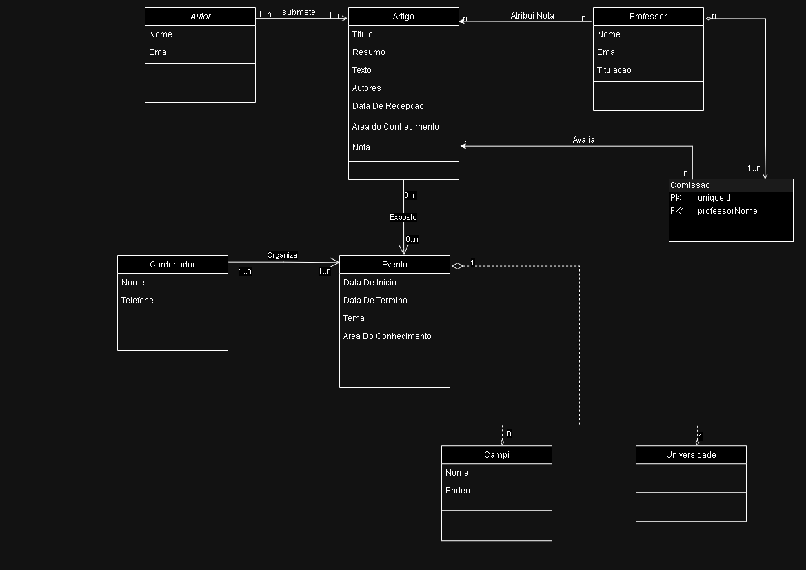

# Diagramas da UFBNA
## Resumo

UFBNA é uma universidade fictícia de um trabalho escolar para aprender na prática:

- gerenciamento de equipes;
- fluxos de projetos;
- arquitetura de sistemas;
- bancos de dados SQL;
- programação front e back-end.

## Problema proposto 
A Universidade "UFBNA" promove com muita frequência eventos científicos de grande interesse no meio acadêmico. No início de cada ano, é publicado um calendário com as datas de todos os eventos que irão ocorrer no ano. Esses eventos sempre ocorrem em um dos campi da Instituição, possuem uma data de início e término, um tema e uma ou mais coordenações de curso responsáveis. Cada evento recebe muitos artigos para apresentação. Por isso, para cada evento é criada uma comissão de professores que tem como função avaliar os artigos, aprovando ou reprovando-os garantindo assim a qualidade do evento. É importante salientar que um professor pode participar da comissão de diversos eventos. Um artigo pode ser enviado para mais de um evento. Cada artigo possui um título, uma abstract (resumo), um texto, uma data de recepção na secretaria de eventos, autores e uma área do conhecimento. É importante saber o nome e e-mail dos autores. Assim que um artigo é recebido, ele é enviado aos professores da comissão que pontuam o artigo (0-10). Se a média do artigo obtida pela avaliação dos professores for maior que 7, o mesmo será apresentado no evento. Cada professor possui um nome, um e-mail, uma titulação e ensina disciplinas.

### O modelo de dados deve resolver as seguintes necessidades:

- Quando da publicação dos cartazes de propaganda, é importante que apareça o nome e o endereço completo do campus onde será realizado o evento, os nomes e telefones dos coordenadores dos cursos responsáveis pelo evento;

- É importante saber a nota que cada professor atribuiu a cada artigo avaliado.
--- 

